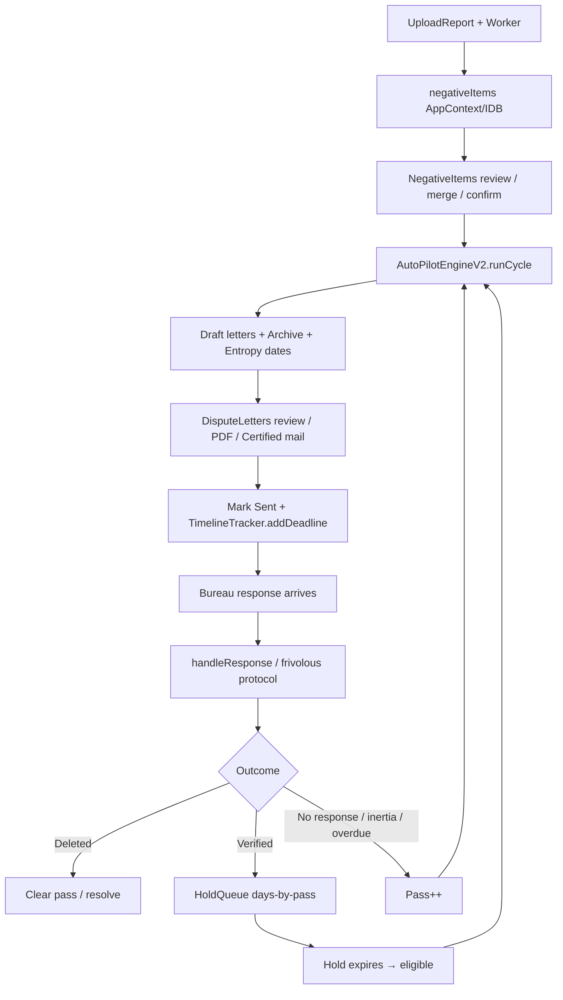

# DylandOs Ultimate Credit Repair Suite  
# World-Class Technical Deep Dive

**Product:** Dylando Ultimate Credit Repair Suite  
**Version:** 5.0.0  
**App ID:** `com.dylandos.creditrepairsuite`  
**Package:** `dylando-ultimate-credit-repair-suite`  
**Audience:** Engineers, auditors, and AI agents performing upgrades, fixes, ports, or security reviews  
**Codebase aligned:** July 21, 2026  

**Companion docs**
| Doc | Use when |
|-----|----------|
| `technicalmanifestwindowsandroid.md` | **Primary cross-platform Windows+Android reference** (≤1500 lines) |
| `DYLANDOS-AI-REFERENCE.md` | Fast orientation / change rules |
| `docs/credit-report-parser-v5-deep-dive.md` | Parser porting detail |
| `docs/autopilot/autopilot-world-class-upgrade-plan.md` | Roadmap priorities |
| `docs/windows/.../windows-deep-dive.md` | Historical Electron notes |
| `docs/android/android-deep-dive.md` | Capacitor / native (may lag) |

---

## Table of contents

1. [Executive architecture](#1-executive-architecture)
2. [Technology stack & build graph](#2-technology-stack--build-graph)
3. [Repository map](#3-repository-map)
4. [Application shell & navigation](#4-application-shell--navigation)
5. [State management (AppContext)](#5-state-management-appcontext)
6. [Persistence architecture](#6-persistence-architecture)
7. [Security, keys & vault](#7-security-keys--vault)
8. [Domain model reference](#8-domain-model-reference)
9. [Credit report parser (live v5)](#9-credit-report-parser-live-v5)
10. [AI router](#10-ai-router)
11. [Letter generation stack](#11-letter-generation-stack)
12. [Dispute engine state machine](#12-dispute-engine-state-machine)
13. [AutoPilot V2 — full cycle anatomy](#13-autopilot-v2--full-cycle-anatomy)
14. [AutoPilot supporting engines](#14-autopilot-supporting-engines)
15. [Timing, FCRA clocks & dispatch entropy](#15-timing-fcra-clocks--dispatch-entropy)
16. [End-to-end product data flow](#16-end-to-end-product-data-flow)
17. [Pages & feature surfaces](#17-pages--feature-surfaces)
18. [Electron (Windows) platform](#18-electron-windows-platform)
19. [Android (Capacitor) platform](#19-android-capacitor-platform)
20. [Service catalog](#20-service-catalog)
21. [Magic numbers & thresholds](#21-magic-numbers--thresholds)
22. [Known dual-systems, quirks & gotchas](#22-known-dual-systems-quirks--gotchas)
23. [Operational runbooks](#23-operational-runbooks)
24. [Upgrade & contribution contracts](#24-upgrade--contribution-contracts)
25. [Appendices](#25-appendices)

---

## 1. Executive architecture

DylandOs is a **privacy-first, on-device** credit dispute operations platform. One React/TypeScript codebase ships to:

- **Web** (Vite) — local browser persistence
- **Windows desktop** (Electron 41) — DPAPI key/vault stores, FS vault, OS scheduler hooks
- **Android** (Capacitor 8) — Keystore vault, WorkManager AutoPilot, print/camera plugins

### System context

```
┌──────────────────────────────────────────────────────────────────┐
│                         USER DEVICE                              │
│  ┌────────────┐   ┌──────────────┐   ┌────────────────────────┐  │
│  │ React UI   │──▶│ AppContext   │──▶│ IndexedDB DYLANDOS_DB  │  │
│  │ pages/     │   │ + profiles   │   │ + localStorage caches  │  │
│  └─────┬──────┘   └──────┬───────┘   └────────────────────────┘  │
│        │                 │                                       │
│        ▼                 ▼                                       │
│  ┌─────────────────────────────────────────────────────────────┐ │
│  │ Services layer (~85 modules)                                │ │
│  │ Parser │ AI Router │ Letter V2 │ AutoPilot V2 │ Vault │ …   │ │
│  └───────────────┬───────────────────────────┬─────────────────┘ │
│                  │                           │                   │
│                  ▼                           ▼                   │
│         External AI APIs              Native bridges             │
│     Groq / Gemini / CF / OpenAI    electronAPI / Capacitor       │
└──────────────────────────────────────────────────────────────────┘
```

### Design principles (non-negotiable)

1. **Local-first** — PII and evidence stay on device; AI receives only prompt-necessary fields.
2. **AppContext is UI source of truth** — services mutate domain artifacts; UI state flows through context.
3. **Single AI gateway** — all model calls via `src/services/aiRouter.ts`.
4. **Heuristic parser in production upload path** — live `creditReportParser/` is `heuristic_only` (no AI enhancer in orchestrator).
5. **AutoPilot V2 is generate-and-queue** — cycles produce validated **draft** letters + schedules; mailing/deadlines start when the user (or mail API) marks acceptance/sent.
6. **Idempotent cycles** — duplicate letter windows, hold replacement, and single-flight `isRunning` prevent double-dispatch chaos.
7. **Bureau-aware strategy** — Equifax / Experian / TransUnion calibration differs by tone, frivolous risk, and response latency assumptions.

### What the product optimizes for

| Goal | Mechanism |
|------|-----------|
| Deletion / correction probability | Pass ladder, Metro 2, dual-target, strategy rotation |
| Anti-automation / anti-spam | Entropy mail stagger, letter DNA, uniqueness scoring |
| Legal auditability | History events, dispute history V2, cycle audit store |
| Risk control | Evidence gate, frivolous guard, pre-flight DOFD/address |
| Continuity | IDB v4 + localStorage write-through (BUG-08 migration) |

---

## 2. Technology stack & build graph

| Layer | Technology |
|-------|------------|
| UI | React 19, TypeScript ~5.8 |
| Bundler | Vite 6 (`base: '/'` web, `'./'` Electron) |
| Styling | Tailwind CSS 4 (`@tailwindcss/vite`) |
| Primitives | Radix checkbox/label/slot + `src/components/ui/*` |
| Icons / motion | lucide-react, motion |
| PDF ingest | pdfjs-dist (+ custom Y-coordinate line grouping) |
| PDF export | jspdf, html2pdf.js, html2canvas |
| Desktop | Electron 41, electron-builder (NSIS + Portable + dir, x64) |
| Mobile | Capacitor 8 → Android API 35 target / 24 min |
| AI SDKs | `@google/genai` + raw HTTP for Groq / Cloudflare / OpenAI Responses |
| ZIP | adm-zip (Electron export), jszip (web) |
| CSV | papaparse |

### Scripts (`package.json`)

```bash
npm run dev                 # Vite :3000
npm run build               # dist/
npm run build:electron      # BUILD_TARGET=electron vite build
npm run electron:dev        # Vite :5173 + Electron
npm run electron:build      # electron build + electron-builder
npm run cap:sync            # build + cap sync android
npm run cap:open            # Android Studio
npm run lint                # tsc --noEmit
npm run test:upgrade        # scripts/final-upgrade-regression.ts
```

### Version constants

- `APP_VERSION = "5.0.0"` in `src/context/AppContext.tsx`
- IndexedDB `DYLANDOS_DB` **version 4**
- Capacitor `appId`: `com.dylandos.creditrepairsuite`

---

## 3. Repository map

```
/
├── src/
│   ├── App.tsx / main.tsx
│   ├── types.ts                      # Primary UI domain types
│   ├── types/creditRepair.ts         # AutoPilot V2 / profile / letter V2
│   ├── context/AppContext.tsx        # Global state + persistence orchestration
│   ├── context/ToastContext.tsx
│   ├── pages/                        # 17 screens
│   ├── components/                   # Feature UI + layout + ui/
│   ├── services/                     # Business engines (~85 files)
│   │   ├── creditReportParser/       # LIVE parser
│   │   └── platform/                 # Android JS bridges
│   ├── workers/creditReportParserWorker.ts
│   ├── config/disputeTimingConfig.ts
│   ├── data/                         # SOL DB, state AG addresses
│   └── lib/utils.ts
├── electron/main.cjs, preload.cjs, icons
├── android/                          # Capacitor native + Java plugins
├── docs/                             # Subsystem deep dives
├── scripts/                          # Regression utilities
├── Testparsercreated/                # Standalone parser playground (NOT prod)
├── release/                          # Built Windows artifacts
├── public/                           # Assets + pdf.worker.mjs
├── capacitor.config.ts
├── electron-builder.json
├── vite.config.ts
├── DYLANDOS-AI-REFERENCE.md
└── DYLANDOS-TECHNICAL-DEEP-DIVE.md   # THIS FILE
```

**Ignore for production behavior unless tasked:** `Testparsercreated/`, much of `scripts/` type noise, duplicate v4 narrative at bottom of `README.md`.

---

## 4. Application shell & navigation

### Boot (`src/App.tsx`)

1. Mount `AppProvider` → `ToastProvider` → `AppContent`
2. One-shot AutoPilot migration: `runAutopilotMigration(profileIds)` → `restoreFromIDB(profileIds)`
3. Optional Android update check (Gist manifest, ≤1 / 12 hours)
4. Hotkey **Ctrl+Shift+D** toggles `DebugParsePanel`
5. Client-side page switch (no React Router) via `AppPage` union

### Pages (`AppPage`)

`dashboard | upload | negative-items | dispute-letters | autopilot | dispute-calendar | vault | history | score-tracker | address-lookup | sol-calculator | settings | profile | gamification | tools | more | credit-builder`

Nav defined in `src/components/layout/Layout.tsx`. Command palette available. Themes: `cyber | stealth | inferno | venom | arctic`.

---

## 5. State management (AppContext)

**File:** `src/context/AppContext.tsx`

### Persisted `AppState` fields (IndexedDB `appState` key `"main"`)

| Field | Meaning |
|-------|---------|
| `reports` | Upload metadata |
| `negativeItems` | Dispute inventory (core) |
| `disputeLetters` | UI letter list |
| `personalInfo` | Letter identity block |
| `contacts` | Furnisher/bureau address book |
| `autopilot` | Feature flags (dual dispute, CFPB auto, mail provider, Android updater…) |
| `security` | App lock / biometric flags |
| `gamification` | XP / level |
| `theme` | Visual theme |
| `campaigns` | Legacy Autopilot v1 campaign objects |
| `creditCards`, `hardInquiries`, `auAccounts`, `boostPrograms` | Credit Builder |
| `appVersion` | Migration gate |

### Loaded separately (not in `main` blob)

- Vault docs, history events, autopilot logs, score entries → dedicated IDB stores
- Multi-profiles → **localStorage** `dylandos_profiles_v4` + `dylandos_active_profile_v4`
- AutoPilot passes/holds/FCRA/cycle audit → IDB v4 + LS write-through

### Boot sequence

1. `openDB()` → `migrateFromLocalStorage()` (legacy `DYLANDOS_CREDIT_DATA`)
2. `loadAppState("main")` → `runMigrations()` → hydrate React
3. Parallel: vault docs, history, AP logs (200), scores
4. Electron: `vaultGetMasterKey()` → `VaultEncryptionService.initWithMasterKey`
5. `syncKeysFromSecureStorage()` into AI router cache
6. Load profiles from localStorage
7. `isDbReady = true` → autosave effect arms

### Autosave

The autosave effect writes credit-builder fields into `main` and its dependency array **includes** `creditCards` / `hardInquiries` / `auAccounts` / `boostPrograms`. Full SSN is redacted to last-4 before IDB write.

### Important helpers

```ts
calcPriorityScore(item): number   // 0–100 type + recency + balance
calcSOLDropDate(item): string|null // DOFD/open + 7y FCRA reporting heuristic
```

Applied inside `addNegativeItems` along with defaults (`disputeRound: 1`, `disputeStatus: "Undisputed"`).

### Reset

| Action | Effect |
|--------|--------|
| `clearData()` | Resets UI; clears IDB including AutoPilot v4 stores (`autopilotState`, `holdQueue`, `fcraTimeline`, `cycleAudit`); clears LS including profiles; **does not** clear Electron DPAPI files or Android Keystore material |
| `clearNegativeItems()` | Clears items + selective LS; patches `main.negativeItems = []` |
| `clearHistoryEvents()` | In-memory only (IDB history remains append-only) |

### Vault limits

- Total vault: **1 GB**
- Per file: **60 MB**

### Profile switching caveat

`switchProfile` updates active id in LS. It does **not** automatically swap the global `negativeItems` / `disputeLetters` arrays by profile. AutoPilot engines key state by `profileId`; UI inventory is effectively shared unless callers filter. There is a **second** profile schema in IDB `userProfiles` (`UserProfileRecord`) distinct from `CreditProfile`.

---

## 6. Persistence architecture

**File:** `src/services/indexedDB.ts`  
**Database:** `DYLANDOS_DB` **v4**

### Object stores

| Store | KeyPath | Indexes | Notes |
|-------|---------|---------|-------|
| `appState` | `key` | — | Main snapshot |
| `vaultDocs` | `id` | byType, byDate | Encrypted when unlocked |
| `historyEvents` | `id` | byTimestamp, byType, byItemId | Append-only UI audit |
| `autopilotLogs` | `id` | byTimestamp | Engine log stream |
| `scoreEntries` | `id` | byDate | Score tracker |
| `disputeItems` | `id` | byNegativeItemId, byUserId, byPriority | Engine dispute items |
| `generatedLetters` | `id` | byDisputeItemId, byBureau, byRound | Encrypted when unlocked |
| `bureauResponses` | `id` | byDisputeItemId, byBureau | |
| `disputeOutcomes` | `id` | byAccountType, byBureau, byOutcome, byStrategy | Learning dataset |
| `userProfiles` | `id` | byName | Encrypted when unlocked |
| `autopilotState` | `key` | — | Passes, engineState, migration sentinel |
| `holdQueue` | `id` | byProfile, byItem, byExpiry | |
| `fcraTimeline` | `id` | byProfile, byItem, byDeadline, byStatus | |
| `cycleAudit` | `cycleId` | byProfile, byRunAt | Full cycle history |

**Schema note:** Older docs mentioned a phantom `disputeLettersV2` clear — current `clearData` no longer references it.

### Encryption wrapper

```ts
{ id, encrypted: EncryptedLocalRecord, disputeItemId? }
```

`LocalDataEncryption` (PBKDF2 600k + AES-GCM) wraps vaultDocs / generatedLetters / userProfiles. Legacy plaintext records still decrypt-pass-through.

### Dual-write AutoPilot pattern (BUG-08)

`autopilotMigration.ts`:

- One-shot LS → IDB migration with sentinel `autopilot_migration_v4_complete`
- Write-through helpers: `idbSavePassNumbers`, `idbSaveHoldQueue`, `idbSaveFCRADeadlines`, `idbSaveEngineState`
- `restoreFromIDB` warms localStorage so **synchronous** engine reads stay fast after refresh

### localStorage keys (operational)

| Key / prefix | Role |
|--------------|------|
| `dylandos_autopilot_v2_state` | Engine state cache |
| `dylandos_item_passes_v2_*` | Per-profile pass map |
| `dylandos_hold_queue_v1` | Hold cache |
| `dylandos_fcra_timeline_v1` | Deadline cache |
| `dylandos_dispute_history_v2` | History fallback |
| `dylandos_cycle_backup_*` | Pre-cycle backup |
| `dylandos_profiles_v4` / `dylandos_active_profile_v4` | Multi-profile UI |
| `dylandos_*_api_key` | Web key fallback |
| `dylandos_ai_provider_mode` | `free-first` \| `quality-first` |
| `DYLANDOS_CREDIT_DATA` | Legacy migrate source |

Separate history DB used by `DisputeHistoryService`: `DylandosHistoryDB` / `dispute_history_v2` (with LS fallback).

---

## 7. Security, keys & vault

### API keys — `secureKeyService.ts`

`KEY_NAMES`: Groq, Groq_2, Gemini, OpenAI, Cloudflare (+ account id), Lob, PostGrid, Stannp.

| Platform | Backend |
|----------|---------|
| Electron | IPC → DPAPI file `userData/dylandos-keys.enc` (write fail-closed if DPAPI unavailable) |
| Android | Capacitor SecureStorage when available |
| Web | **In-memory session only** for new keys — no plaintext `localStorage` write fallback |

AI router keeps in-memory `_keyCache`; `syncKeysFromSecureStorage()` hydrates on boot. Legacy keys may still be read once during migration off `localStorage`.

### Two vault layers (do not conflate)

| Layer | Where | Crypto |
|-------|-------|--------|
| **UI Vault** | IndexedDB `vaultDocs` | `LocalDataEncryption` (passphrase unlock) |
| **FS Vault** | Electron `userData/vault/` or Android `filesDir/vault/` | Electron: AES-256-GCM + DPAPI master key; Android: AndroidKeyStore AES-GCM |

Electron FS layout:

```
vault/
  audit/audit_log.enc
  _deleted/                 # soft deletes
  profiles/{profileId}/
    disputes/
    responses/
    timeline/
    reports/
    export/
```

Path traversal blocked via `safeRelativePath`. Export packages via AdmZip.

### SSN handling

| Module | Behavior |
|--------|----------|
| `SSNSecureService` | Electron-only DPAPI `ssn-store.enc`; refuses web/Android |
| Android `SecureVaultPlugin` | EncryptedSharedPreferences for SSN |
| Profiles | Typically store `ssnLast4` only in UI profile objects |

### Electron window security posture

- `nodeIntegration: false`, `contextIsolation: true`, `sandbox: true`, `webSecurity: true`
- Navigation restricted to `file://` / localhost; external → `shell.openExternal`
- HTTPS-only for `open-external`

---

## 8. Domain model reference

### Primary types — `src/types.ts`

#### `NegativeItem`

Identity, money, dates, bureaus, dispute tracking, strategy flags, parser metadata, Metro 2 `accountStatus` / `metro2Violations`.

Critical dispute fields:

- `disputeRound: 1|2|3|4|5|6`
- `disputeStatus` — Undisputed → RoundN-Pending/Verified → Round4-Legal → Round5-CFPB → Round6-PreLit → Deleted/Won
- `priorityScore`, `solDropDate`, `forceStrategy?`, `doubleVerified?`, `isMedicalDebt?`, `dataSource?`

#### `DisputeLetter`

UI letter: content/htmlContent/bodyContent, bureau, round, templateType, mail tracking, uniqueness metadata, `aiProviderUsed`.

#### `LetterTemplateType`

```
609-Identity | 609-Disclosure | 611-Reinvestigation | 623-Furnisher |
611a7-MethodOfInvestigation | Goodwill | PayForDelete | CeaseAndDesist |
DualDispute-BureauFurnisher | CFPBComplaint | CFPBComplaintStateAG |
PreLitigation | AggressiveDual | ReInsertionViolation
```

### AutoPilot types — `src/types/creditRepair.ts`

| Type | Role |
|------|------|
| `CreditProfile` | Multi-profile consumer record |
| `PassNumber` | `1…6` |
| `PassItemStatus` | queued / in_dispute / verified_hold / no_response / deleted / resolved / persist_final / overdue / complaint_ready |
| `PassStrategy` | accuracy_challenge → method_of_verification → procedural_violation → cfpb_complaint_threat → formal_intent_to_complain → final_demand → legal_demand (+ goodwill / P4D variants) |
| `HoldQueueEntry` | Hold window per item/profile/pass |
| `DispatchTarget` / `DispatchPlan` / `DispatchPlanItem` | Cycle targeting |
| `GeneratedLetterV2` | Engine letter with status `draft\|blocked\|approved\|queued\|sent\|archived` + `scheduledMailingDate` |
| `AutoPilotCycleResult` | Full cycle output |
| `AutoPilotSettingsV2` | Engine settings |
| `DisputeEventV2` / `DisputeEventTypeV2` | Immutable event log (~25 types) |
| `FCRADeadline` | active/overdue/resolved/extended |
| `CFPBComplaintPack` | Regulatory pack |
| `SchedulerState` | Next/last cycle + missedCycles |

### Default engine settings

```ts
DEFAULT_SETTINGS_V2 = {
  enabled: false,
  batchFraction: 0.33,
  maxItemsPerBatch: 8,
  dualTargetMode: true,
  holdDaysByPass: { 1: 60, 2: 60, 3: 45, 4: 30, 5: 14, 6: 15 },
  cycleIntervalDays: 32,
  letterAutoApprove: false,      // present but not applied inside runCycle
  aiModel: 'groq',
  noResponseThresholdDays: 35,
  autoGenerateCFPBOnPass5: true,
  autoGenerateStateAGOnPass5: false,
  backupBeforeCycle: true,
}
```

### Pass 6 strategy

`PASS_6_STRATEGY`: Pre-Litigation Statutory Demand; citations §616/§617/§611/§623; 15-day hold; triggers after Pass 5 + CFPB context / 45+ days no substantive response.

---

## 9. Credit report parser (live v5)

**Authoritative code:** `src/services/creditReportParser/`  
**Authoritative doc:** `docs/credit-report-parser-v5-deep-dive.md`

### File roles

| File | Role |
|------|------|
| `index.ts` | Orchestrator `parseCreditReport(options)` |
| `creditParser.ts` | Golden negative detection |
| `extractor.ts` | PDF Y-extract, normalize, consumer info, bureau detect |
| `bureauNormalizers/transunionNormalizer.ts` | TU column repair |
| `workers/creditReportParserWorker.ts` | Off-main-thread |

**Critical:** `extractor.heuristicExtract()` exists but is **not** called by the live orchestrator. Detection is **only** `creditParser.parseNegativeItems()`. Always returns `parseMethod: 'heuristic_only'` with AI debug counters zeroed.

### Orchestrator pipeline

```
INPUT source: pdf_buffer | paste | file_path
  │
  ├─1─ Acquire text (5%)  — reject if < 50 chars
  ├─2─ normalizeText (20%) — NFKC, ligatures, hyphen-NL, keep tabs
  ├─3─ extractConsumerInfo + detectBureaus (35%)
  ├─3b─ If TU or multi-bureau → preprocessTransUnionText + normalizeTransUnionText
  ├─4─ parseNegativeItems (55%)
  └─5─ mapParsedToNegativeItem (85→100%)
```

**Success:** `items.length > 0` (empty = failure even if PDF extracted).  
**Needs review:** `parseConfidence < 0.55`.

### PDF extraction (Y-coordinate)

- pdf.js with inlined worker blob
- Group glyphs by `Math.round(y/4)*4` buckets
- Sort Y descending, X ascending within line
- Gaps: `> 40` PDF units → TAB (column); `> -1` → space; else glue
- Strip headers/footers appearing on ≥60% of pages
- Join pages with `\n\n` (no page markers that split spanning accounts)

### Detection priority (`creditParser.ts`)

First match wins per region, then continue:

1. TransUnion Annual Credit Report — conf **96**
2. TransUnion portal snapshot — conf **95** (charge-off/collection only)
3. TransUnion “Accounts with Adverse Information” — conf **94**
4. Equifax accounts + collections — base **88**, boosts for past-due / narrative 057/067; collections **99**
5. Experian `POTENTIALLY NEGATIVE` blocks + generic `splitPotentialBlocks`

**Dedup key:** `bureau|creditor|accountNumber|dateOpened` (higher confidence wins).

**Generic confidence signals:** negative keyword +35, status +20, account # +20, creditor labels +15, dates +10, etc. Clamp 0–100. Hard-reject inquiry/public-record noise without account context.

### Mapping to app `NegativeItem`

Parser confidence 0–100 → `parseConfidence = confidence/100`. Unknown bureau → **empty `creditBureau[]`** (never invent Experian). Real DOFD only (`dateOfFirstDelinquency` / delinquency fields — **never** fabricated from `dateOpened`). `$0` balances are kept. Defaults: `dataSource: 'parser'`, round 1, Undisputed. Specialized extractors are **unioned** (no early-exit that drops EQ/EX).

### Worker protocol

```
Main → Worker: { type: 'PARSE', options }  // PDF buffer transferred zero-copy
Worker → Main: PROGRESS | RESULT | ERROR
```

Fresh worker per parse; terminated on settle. Spawned from `UploadReport.tsx`.

### Gotchas

- `detectBureaus` with no match returns **all three** bureaus.
- Multi-bureau always triggers TU preprocess (intentional).
- Legacy `geminiService.parseCreditReport` (chunked AI) still exists for alternate flows — **Upload UI uses worker + creditReportParser**.

---

## 10. AI router

**File:** `src/services/aiRouter.ts`

### Public API

```ts
routeAIRequest(messages, options?): Promise<string>
aiComplete(system, user, taskType?): Promise<string>
routeAIRequestFast(messages, options?): Promise<string>  // smaller maxTokens
aiStream(system, user, onChunk, taskType?): Promise<void>
checkProviderHealth(): Promise<...>
getProviderStatus(): Array<{name, available, configured, cooldownRemaining}>
syncKeysFromSecureStorage(): Promise<void>
// + get/set for Groq×2, Gemini, OpenAI, Cloudflare
```

### Models

| Provider | Chain |
|----------|-------|
| Groq | `llama-3.3-70b-versatile` → `llama-3.1-8b-instant` |
| Gemini | `gemini-2.5-pro` → `2.5-flash` → `2.0-flash` → `1.5-flash` |
| Cloudflare | `@cf/meta/llama-3.3-70b-instruct-fp8` |
| OpenAI | `gpt-5.6-luna` via `/v1/responses` (temperature omitted in body) |

### Cascade by `taskType`

**Default free-first:** Groq → Gemini → Cloudflare → OpenAI  

**Gemini-first:** `parse`, `cfpb_narrative`, `legal_demand`  

**Quality-first mode** (`dylandos_ai_provider_mode`): for letter/legal/cfpb → OpenAI → Gemini → Groq → CF  

### Resilience

| Control | Value |
|---------|-------|
| HTTP 429 cooldown | **60_000 ms** |
| Max consecutive failures before skip | **15** |
| Groq dual-key | Round-robin; per-key cooldown on 429; 401 tries next key |

### Temperature policy

| Tasks | Temp |
|-------|------|
| letter, legal_demand, variation | **0.85** |
| cfpb_narrative, goodwill | **0.80** |
| analyze, metro2, cross_bureau, score_impact | **0.30** |
| parse, classify | **0.15** |
| default | **0.45** |

**Override note:** `letterGeneratorV2` often sets letter temp to `0.7 + (attempt-1)*0.05`, not 0.85.

### Concurrency

`apiQueueManager.ts` caps parallel AI work to reduce Groq 429 storms. AutoPilot also inserts a **3000 ms** inter-letter cooldown in the generation loop.

---

## 11. Letter generation stack

### Two production pipelines

| Pipeline | Entry | Consumers |
|----------|-------|-----------|
| **V2 engine** | `letterGeneratorV2.generateDisputeLetter(req)` | **AutoPilotEngineV2** |
| **UI / templates** | `geminiService.generateDisputeLetter(...)` | DisputeLetters page, helpers |

`geminiService` name is historical — it is a multi-provider facade over `aiRouter`, not Gemini-only.

### V2 generation pipeline (`letterGeneratorV2.ts`)

1. Enqueue via `apiQueueManager`
2. Optional disclosure branch if `requiresDisclosureRequest`
3. Else: `buildLetterDNA` → `generateEntropyMix` → persona + `PASS_STRATEGY_MATRIX[pass]`
4. System prompt = persona + entropy addendum + dispute policy
5. `routeAIRequest({ taskType: 'letter', temperature: 0.7+…, maxTokens: 1600 })`
6. Strip greetings/closings → `normalizeConsumerVoice` → optional voice repair (temp 0.1)
7. `assertMinimumLength(200)` + soft citation warn
8. **On failure → `renderDeterministicDisputeLetter(req)`** (4-paragraph factual fallback)

**Pass strategy anchors (V2 matrix):**

| Pass | Posture | Anchors |
|------|---------|---------|
| 1 | Accuracy | §1681i(a)(1) |
| 2 | Reinvestigation | §1681i(a)(1),(a)(6) |
| 3 | Furnisher | §1681s-2(a)(8), 12 CFR §1022.43 |
| 4 | Procedure | §1681i(a)(6),(a)(7) |
| 5 | CFPB narrative | CFPB complaint authority |
| 6 | Legal / final | §616/617/611/623, §1681n/o |

Live entropy addendum is **mild** controlled diversity (aggressive synonym engine short-circuits early — dead code after return).

### Uniqueness / anti-spam family

| Module | Mechanism | Threshold |
|--------|-----------|-----------|
| `letterDNA.ts` | djb2 seed from `acct\|creditor\|profile\|round` → persona/angle/hooks | — |
| `entropyLetterMixer.ts` | Citation format, 3–5 paras, demand phrasing | — |
| `antiSpamDisputeEngine.ts` | Fingerprint uniqueness score | SAFE ≥60, CAUTION 40–59, HIGH_RISK &lt;40 |
| `letterUniquenessService.ts` | 3/5-gram Jaccard vs priors | Rewrite if similarity **> 0.65** |
| `letterValidator.assertNoBoilerplate` | Exact + fuzzy (≥0.82) + semantic (≥0.78) | Throws |

**DNA gotcha:** opening-hook pool includes “Pursuant to 15 U.S.C.…” which can conflict with anti-boilerplate / fact-only opening rules. AutoPilot still injects DNA into prompts; `assertNoBoilerplate` runs **after** generation in the cycle, not inside V2 success path.

### Grounding & placeholders

- `letterGroundingService` — blocks unknown citations / invented balances; sanitizes §609 slippage → §611
- `placeholderService` — fills `[brackets]` / `{{mustache}}`; `scanForUnfilledTokens` can **block** letter status

### Validation / export / format

| Service | Role |
|---------|------|
| `letterValidator.ts` | Boilerplate gate used by AutoPilot + DisputeLetters |
| `deterministicLetterRenderer.ts` | Fail-closed factual letter |
| `batchExportService.ts` | Multi-letter PDF + optional certified mail cover |
| `letterFormatter.ts` | Times New Roman print HTML |
| `printService.ts` / `pdfGeneratorAndroid.ts` | Platform print |

### Type collision warning

There are **three** different `GeneratedLetter` shapes across V2 request results, `disputeEngine`, and `creditRepair.GeneratedLetterV2`. Always check the importing module’s type.

---

## 12. Dispute engine state machine

**File:** `src/services/disputeEngine.ts`

Pure **state machine + types** for 6-round per-bureau tracks. Not the scheduler and not the letter author.

| Concern | Owner |
|---------|-------|
| States, strategies, response transitions | `disputeEngine.ts` |
| Persist engine DisputeItems / responses | `indexedDB.ts` |
| Cycle orchestration + letter gen | `autoPilotEngineV2.ts` → `letterGeneratorV2` |

Key APIs: `getStrategyForRound`, `applyBureauResponse`, `createBureauTrack`, `createDisputeItemFromNegative`, `isCFPBComplaintReady` (≥2 completed rounds + invalid response + ≥60 days since first send), `calculateFCRADamages`, `generateLetterDNA` (**different** from `letterDNA.buildLetterDNA`).

Response transitions (summary): DELETED/UPDATED → resolved; NO_RESPONSE / RE_INSERTED / FRIVOLOUS / VERIFIED (rounds &lt;6) → next READY; VERIFIED at round ≥6 → `ATTORNEY_REFERRAL_READY`.

AutoPilot maps its own `PassNumber` / `PassStrategy` enums — loosely parallel, **not identical**.

---

## 13. AutoPilot V2 — full cycle anatomy

**File:** `src/services/autoPilotEngineV2.ts`  
**Export:** singleton `AutoPilotEngineV2`

### Public API

| Method | Purpose |
|--------|---------|
| `getState` / `loadState` | Engine state |
| `runCycle(params)` | Full generate-and-queue cycle |
| `handleResponse(params)` | Bureau outcome → hold / escalate / clear |
| `handleFrivolousResponse(params)` | GAP-G challenge plan |
| `scheduleNextCycle` / `cancelSchedule` | Electron scheduler IPC |
| `getPassNumber` / `setPassNumber` | Pass map accessors |
| `buildPass6Prompt` | Pre-litigation prompt |

### There is no dry-run flag on `runCycle`

Every successful path that clears gates **calls the LLM** and archives **draft** letters. Closest read-only analogs: `checkEscalations` vs `applyEscalations`; `getInertiaStatus` vs `evaluateInertia`. UI “preview” language in older docs may overstate — verify current Autopilot page wiring before assuming a no-side-effect preview.

### `runCycle` ordered steps

```
 1. Guard isRunning → throw
 2. cycleId = uuid; isRunning=true; persist
 3. Init AutoPilotCycleResult skeleton
 4. Optional _backupBeforeCycle()
 5. Profile-level preflight (personalInfo FATAL/warn)
 6. DisputeHistoryService.init + cycle_started
 7. HoldQueue.processQueue → nowEligible / stillHeld
 8. TimelineTracker.getOverdue (log)
 9. Load pass numbers
10. applyEscalations → save if changed
11. evaluateInertia → save; result.inertiaEscalations
12. For each newly eligible hold: pass = min(6, current+1)
13. Pre-filter duplicates (_checkDuplicateLetter) before batch fill
14. BatchSelector.selectBatch
15. Per-item preflight (DOFD / address)
16. Frivolous guard: getRotationStrategy + assessFrivolousRisk
    → high+hold → HoldQueue 14d FrivolousGuard
17. Filter eligible; collect actionRequired; log failures
18. projectScoreImpact (non-blocking)
19. Early exit if empty batch
20. TargetPlanner.planAllTargets
21. Build DispatchPlan
22. Letter loop (per planItem × target):
    a. duplicate check → skip
    b. evaluateEvidenceReadiness → block if !canProceed
    c. history (pass≥3) + rotation strategy
    d. bureauCalibrationDirective
    e. findCrossBureauDeletions (pass≥2, bureau)
    f. enrichTarget (furnisher addresses)
    g. Pass 3 → generateDirectDispute; else generateDisputeLetter
    h. scanForUnfilledTokens → may block
    i. evaluateDisputeUniqueness
    j. ArchiveService.archiveLetter + logLetterGenerated
    k. 3000ms cooldown
23. assertNoBoilerplate → blocked letters
24. buildEntropyDispatchSchedule → scheduledMailingDate
25. checkDelinquencyDateManipulation (re-aging → errors[])
26. _savePassNumbers
27. logCycleCompleted
28. finally: completedAt; isRunning=false; persist; saveCycleAuditRecord
```

### Idempotency rules

| Rule | Mechanism |
|------|-----------|
| Single-flight | `isRunning` throw |
| Duplicate letter window | Any `pass_letter_generated` **or** `pass_letter_sent` for same item+pass within **30 days** → skip |
| Hold replace | `addToHold` replaces same item+profile |
| Deadline dedupe | `addDeadline` returns existing identical key |
| Escalation settle | Resolve deadline after apply so it doesn’t re-fire |

### Persistence during cycle

| Data | LS cache | Durable |
|------|----------|---------|
| Pass numbers | `dylandos_item_passes_v2_*` | IDB `autopilotState` |
| Engine state | `dylandos_autopilot_v2_state` | IDB |
| Holds | `dylandos_hold_queue_v1` | IDB `holdQueue` |
| Letters | — | `ArchiveService` under `profiles/{id}/disputes/cycle_*` |
| Cycle audit | — | IDB `cycleAudit` |
| Events | LS fallback | DisputeHistory IDB |
| Pre-cycle backup | LS only | `dylandos_cycle_backup_*` |

**Deadline creation:** Generation does **not** start FCRA clocks. `TimelineTracker.addDeadline` occurs on provider acceptance / explicit manual-mail / UI sent flows.

### `handleResponse` outcomes

| Outcome | Effect |
|---------|--------|
| deleted | Release hold, clear pass, capture outcome |
| verified | Hold for `holdDaysByPass[pass]` |
| no_response | Bump pass (≤6) |
| frivolous | `handleFrivolousResponse` / challenge plan |
| updated | Partial resolution / watch |

### `AutoPilotCycleResult` fields

`cycleId`, `profileId`, `startedAt`, `completedAt`, `itemsProcessed`, `lettersGenerated`, `itemsSkippedDuplicate`, `itemsOnHold`, `inertiaEscalations?`, `entropySchedule?`, `errors[]`, `dispatchPlan`, `letters[]`, `nextCycleDate`, `preFlightPassed`, `preFlightErrors`, `itemsRequiringAction?`

---

## 14. AutoPilot supporting engines

### Batch selection — `batchSelector.ts`

1. Skip Deleted/Won; skip SOL if `autoRemovalDate` past or **&lt;30 days** remaining  
2. Skip `HoldQueue.isOnHold`  
3. `ItemScorer.scoreItems` → sort  
4. `batchSize = min(ceil(candidates * batchFraction), maxItemsPerBatch)`  
5. Soft cap **2 items per creditor**, then backfill without cap  

### Item scoring — `itemScorer.ts`

`totalScore = deletability*0.6 + urgency*0.4`. Baseline deletability 50; type/age/bureau/verification modifiers; expiration radar can zero. Pass modifiers: `{1:0, 2:5, 3:8, 4:5, 5:-5, 6:-8}`.

### Target planning — `targetPlanner.ts`

One bureau target per `creditBureau` entry (default all 3). Furnisher if `dualTargetMode` OR (pass≥2 && collection). Address lookup via furnisher address tables; warn if missing.

Pass → strategy matrix:

| Pass | Bureau | Furnisher |
|------|--------|-----------|
| 1 | accuracy_challenge | same |
| 2 | method_of_verification | fdcpa_validation |
| 3 | procedural_violation | cfpb_complaint_threat |
| 4–5 | formal_intent / final_demand | same |
| 6 | legal_demand | same |

### Hold queue — `holdQueue.ts`

Defaults match V2 hold days. `processQueue` auto-releases expired. Dual-write LS+IDB.

### Timeline — `timelineTracker.ts`

Bureau: **30 + 5 grace = 35** days. Furnisher: **45 + 5**. Storage dual-write.

### Escalation — `escalationEngine.ts`

Overdue → Tier1 +1 pass; ≥**36** days past → Tier2 +2; clamp 1–6; resolve deadline after apply. Read-only: `checkEscalations`; commit: `applyEscalations`.

### Inertia — `inertiaEscalationService.ts`

Letter exists + no later `bureau_response_received`:

| Day | Action |
|-----|--------|
| 30 | Nudge (warn only) |
| 45 | Advance +1 pass |
| 60 | Force +1 pass |

### Evidence gate — `evidenceGateService.ts`

Scoring: Gov ID **+35**, address proof **+25**, type-specific up to ~40.  
Tiers: `&lt;35 BLOCKED`, `35–59 BASIC`, `60–84 STRONG`, `85+ AUDIT_PROOF`. No photo ID → cannot proceed.

### Strategy rotation — `strategyRotationEngine.ts`

Scenarios: `freshly-disputed | no-response | double-verified (≥2) | stalled (pass≥3 same) | pass4-stalled`.  
Re-aging: ODD shifts forward **&gt;7 days**.

### Bureau calibration — `bureauCalibrationEngine.ts`

| Bureau | Approach | ~Latency | Frivolous risk |
|--------|----------|----------|----------------|
| Equifax | Metro 2 technical | ~28d | medium |
| Experian | Consumer rights / CFPB | ~25d | **high** |
| TransUnion | Formal statutory | ~30d | medium |

Pass overlays escalate tone 1→6.

### Frivolous stack

- `frivolousFlagGuard.assessFrivolousRisk` — high if same legal basis ≥2× or two flags; medium if `dateLastActive` &lt;30d alone; can force 14d hold  
- `frivolousResponseService.buildFrivolousChallengePlan` — tiers: demand-notice (3d) → cure-and-refile (1d) → civil-escalation (0d); notice ~7 calendar / 5 business days  

### Pre-flight — `preFlightChecker.ts`

DOFD required for collection/charge-off/repo/foreclosure/judgment/bankruptcy. Address incomplete if length **&lt;12** or bare PO Box → enrich via vault / `AddressResearchAgent` or block.

### Other cycle contributors

`crossBureauAnalyzer.findCrossBureauDeletions`, `metro2AuditService` / `metro2AuditEngine`, `expirationRadarService`, `deletionOutcomeEngine`, `directFurnisherEngine`, `goodwillLetterEngine`, `furnisherChainOfCustodyService`, `scoreImpactProjector`, `disputeClockEngine`, `accountHealingEngine`, `ArchiveService`, `DisputeHistoryService`, `cycleAuditService`.

---

## 15. Timing, FCRA clocks & dispatch entropy

### `src/config/disputeTimingConfig.ts`

| Constant | Value | Meaning |
|----------|-------|---------|
| `BUREAU_RESPONSE_DEADLINE` | 35 | 30 FCRA + 5 buffer |
| `ROUND_TRIGGER_DELAY` | 35 | Auto next-round wait |
| `EXTENDED_INVESTIGATION_DAYS` | 45 | Extension |
| `FURNISHER_RESPONSE_DEADLINE` | 35 | Furnisher window (config; tracker may use 45+5) |
| `CFPB_RESPONSE_TARGET` | 60 | Soft target |
| `AG_RESPONSE_TARGET` | 30 | State AG |
| `LEGAL_DEMAND_RESPONSE` | 30 | Pass 6 / CMRRR |
| `BUREAU_STAGGER` | EQ 0 / EX 5 / TU 10 | Day offsets |
| `MIN_DAYS_BETWEEN_ROUNDS` | 7 | Same bureau gap |
| `DEADLINE_ALERT_LEAD` | 5 | Reminder |
| `DEADLINE_GRACE_PERIOD` | 2 | Past-due grace |

Helpers: business-day add, weekend/holiday shift (2025–2026 calendars), deadline checks, bureau send date, next-round trigger.

### Entropy dispatch — `entropyDispatchScheduler.ts`

Cycle path used by V2:

- Max **2** letters per bureau per day  
- After daily cap → jump **+2 days**  
- Deterministic 0–1 day jitter from item/bureau hash  
- **Pass 5 never delayed**  
- Fallback +30d after 30 placement attempts  

(Also exports a richer production schedule builder with weekday/business-hours 9–15 and default jitter range 3 — verify which export a caller uses.)

---

## 16. End-to-end product data flow



### Narrative

1. **Ingest** — PDF/text → worker → parser → `addNegativeItems` (priority + SOL drop) → autosave  
2. **Review** — negatives UI; optional score impact / deletion probability; cross-bureau merge  
3. **Cycle** — gates → batch → targets → letters → uniqueness/validation → entropy schedule → audit  
4. **Mail** — manual print/batch PDF or `mailDeliveryService` (Lob/PostGrid/Stannp/manual)  
5. **Clock start** — on sent/accept → FCRA deadline  
6. **Outcome** — response logging mutates holds/passes; learning stores outcomes  
7. **Repeat** until deleted/resolved or Pass 6 / CFPB / attorney referral  

---

## 17. Pages & feature surfaces

| Page | File | Primary jobs / services |
|------|------|-------------------------|
| Dashboard | `Dashboard.tsx` | KPIs, digest, reinsertion, genealogy, attorney referral |
| Upload | `UploadReport.tsx` | Worker parse → negatives |
| Negative Items | `NegativeItems.tsx` | CRUD, notes, score impact, deletion probability, merge |
| Dispute Letters | `DisputeLetters.tsx` | geminiService path, validate, PDF, mail, uniqueness, grounding |
| Autopilot | `Autopilot.tsx` | V2 engine UI, holds, timelines, outcomes, dashboard widgets |
| Dispute Calendar | `DisputeCalendar.tsx` | FCRA/SOL calendar |
| Vault | `Vault.tsx` | Evidence docs + ArchiveBrowser |
| History | `History.tsx` | Audit + DisputeHistoryView |
| Score Tracker | `ScoreTracker.tsx` | Manual score entries |
| Address Lookup | `AddressLookup.tsx` | AI + static furnisher book → contacts |
| SOL Calculator | `SOLCalculator.tsx` | 50-state SOL (inline data) |
| Settings | `Settings.tsx` | Theme, AI keys, mail, Android updater, backup/export |
| Profile | `Profile.tsx` | Personal info, security, clear |
| Gamification | `Gamification.tsx` | XP/badges |
| Tools | `Tools.tsx` | Utilization/payoff/CSV/QR |
| Credit Builder | `CreditBuilder.tsx` | Cards, AU, inquiries, boosts |
| More | `MoreMenu.tsx` | Mobile nav hub |

### Notable components

`AutoPilotDashboard`, `HoldQueuePanel`, `TimelinePanel`, `LetterReviewScreen`, `ValidationModal`, `CrossBureauMatrix`, `MergedAccountCard`, `CFPBComplaintView`, `DebugParsePanel`, `ScoreSimulator`, `CommandPalette`.

---

## 18. Electron (Windows) platform

### Files

- `electron/main.cjs` — main process  
- `electron/preload.cjs` — `window.electronAPI`  
- `electron-builder.json` — NSIS + Portable + dir  

### userData layout

```
dylandos-keys.enc
vault-master.enc
vault/…
ssn-store.enc
autopilot/scheduler.json
logs/
```

### IPC surface (summary)

API keys · file dialogs (50MB read cap; **read-file allowlisted** to dialog-picked paths only) · print-to-PDF (**save dialog only** — renderer `outputPath` ignored) · HTTPS-only `openExternal` · notifications · clipboard · vault FS CRUD + audit + export + master key · SSN store · AutoPilot schedule/cancel/status · events: `autopilot:trigger`, `autopilot:cycle-overdue`, `deadline-alert`

Scheduler persists `scheduler.json`; uses **overflow-safe chunked** `setTimeout` (≤ ~24.8d per arm) against wall-clock target. On startup `restoreSchedulerFromDisk()` re-arms; may emit overdue if missed.

### Build outputs (`release/`)

- `Dylando Ultimate Credit Repair Suite Setup 5.0.0.exe`
- `… Portable 5.0.0.exe`
- `win-unpacked/`

---

## 19. Android (Capacitor) platform

### Config highlights (`capacitor.config.ts`)

- `webDir: dist`, `androidScheme: https`, cleartext false  
- Plugins: LocalNotifications, SecureStoragePlugin, DylandosUpdater (manifest URL/channel)  
- Signing via `DYLANDOS_STORE_*` env  

### Native Java plugins

| Plugin | Capacitor name | Capabilities |
|--------|----------------|--------------|
| `AutoPilotPlugin` | `AutoPilot` | WorkManager 12h±15m schedule, status, battery exemption |
| `SecureVaultPlugin` | `SecureVault` | Keystore encrypt/decrypt, SSN prefs, vault FS, audit |
| `PrintPlugin` | — | WebView → PrintManager PDF, share via FileProvider |
| `CameraResponsePlugin` | — | Capture response letter JPEG base64 |
| `AutoPilotWorker` | — | Due-cycle / FCRA / hold notifications + deep links |
| `BootReceiver` | — | Re-enqueue WorkManager on boot (`exported=true` for `BOOT_COMPLETED`) |
| `AutoPilotDataStore` | — | EncryptedSharedPreferences flat state blob |

### JS bridges (`src/services/platform/`)

`androidScheduler.ts`, `androidSecurityService.ts`, `androidArchiveService.ts`, `androidDependencies.ts`, `androidNotificationHandler.ts`, plus `androidUpdateService.ts` (Gist OTA).

**Scheduling contract:** TS sends `{ intervalHours, state: JSON.stringify(flatState) }`. Java parses the **`state` string** (not the Capacitor envelope). `patchOnly` merges `nextCycleDateMs` without wiping timelines/holds. Vault FS paths are canonicalized under the vault dir (no `..` traversal).

**Reality check:** OS background limits mean long campaigns still assume periodic foreground or native worker notifications — not unrestricted always-on desktop scheduling.

---

## 20. Service catalog

Grouped for navigation. Prefer reading the owning file before changing behavior.

### Orchestration
`autoPilotEngineV2`, `autopilotEngine` (legacy), `disputeEngine`, `escalationEngine`, `batchSelector`, `targetPlanner`, `itemScorer`, `holdQueue`, `timelineTracker`, `autopilotMigration`, `cycleAuditService`

### AI & letters
`aiRouter`, `apiQueueManager`, `geminiService`, `letterGeneratorV2`, `letterTemplateService`, `letterValidator`, `letterDNA`, `letterVariation`, `letterUniquenessService`, `letterGroundingService`, `letterFormatter`, `deterministicLetterRenderer`, `entropyLetterMixer`, `antiSpamDisputeEngine`, `disputePromptBuilder`, `disclosurePromptBuilder`, `regenerationService`, `batchExportService`, `printService`, `pdfGeneratorAndroid`, `pdfCanvasService`, `placeholderService`, `personaMatrix`, `consumerVoicePolicy`, `disputeAngleRotator`

### Parser & accounts
`creditReportParser/*`, `sanitizer`, `currencyNormalizer`, `tradelineMerger`, `accountMergeEngine`, `accountIdentityService`, `accountHealingEngine`

### Bureau / legal intel
`bureauCalibrationEngine`, `strategyRotationEngine`, `bureauAddressService`, `addressResearchAgent`, `bureauResponseParser`, `responseScanner`, `metro2Auditor`, `metro2AuditEngine`, `metro2AuditService`, `cfpbComplaintGenerator`, `citationEquivalenceMap`, `frivolousFlagGuard`, `frivolousResponseService`, `inertiaEscalationService`, `evidenceGateService`, `entropyDispatchScheduler`, `crossBureauAnalyzer`, `preFlightChecker`, `directFurnisherEngine`, `furnisherChainOfCustodyService`, `goodwillLetterEngine`, `medicalDebtHandler`, `reInsertionMonitor`, `expirationRadarService`, `disputeClockEngine`

### Outcomes / learning
`deletionOutcomeEngine`, `deletionProbabilityEngine`, `outcomeBasedLearning`, `disputeOutcomeTracker`, `disputeHistoryService`, `disputeGenealogyService`, `intelligenceDigestService`, `scoreImpactProjector`, `attorneyReferralService`

### Persistence / security / platform
`indexedDB`, `secureKeyService`, `vaultEncryptionService`, `userProfileService`, `archiveService`, `platformService`, `platform/*`, `androidUpdateService`, `mailDeliveryService`, `disputeNotifications`

---

## 21. Magic numbers & thresholds

| Concern | Values |
|---------|--------|
| Hold days by pass | 60 / 60 / 45 / 30 / 14 / **15** (Pass 6) |
| Cycle interval | **32** days |
| FCRA track / no-response | **35** (30+5) |
| Furnisher track (timeline) | **45+5** |
| Inertia | 30 nudge / **45** advance / **60** force |
| Escalation Tier-2 | **36** days past deadline |
| Duplicate letter window | **30** days |
| Frivolous guard hold | **14** days |
| Inter-letter AI cooldown | **3000** ms |
| Batch | 33% of eligible, max **8**, soft **2**/creditor |
| Entropy | max **2**/bureau/day, +**2**d gap |
| Evidence BLOCKED | score **&lt;35** (no gov ID) |
| Uniqueness SAFE | antiSpam ≥**60**; n-gram rewrite if sim **&gt;0.65** |
| Boilerplate fuzzy / semantic | ≥**0.82** / ≥**0.78** |
| Parser review | parseConfidence **&lt;0.55** |
| Parser reject short text | **&lt;50** chars |
| Address min length | **12** |
| Re-aging tolerance | **7** days |
| AI 429 cooldown | **60s** |
| AI fail skip | **15** consecutive |
| Letter min length (V2) | **200** (furnisher **250**) |
| Vault caps | 1GB total / 60MB file |
| Pass 6 demand | **15** days |
| CFPB ready (disputeEngine) | ≥2 rounds + ≥**60** days since first send |

---

## 22. Known dual-systems, quirks & gotchas

1. **Two letter pipelines** — UI/`geminiService` vs AutoPilot/`letterGeneratorV2`. Fixes in one may not affect the other.  
2. **Two vaults** — IndexedDB UI vault vs native FS vault.  
3. **Two profile systems** — LS `CreditProfile` vs IDB `userProfiles`.  
4. **Two letter DNA generators** — `letterDNA.buildLetterDNA` ≠ `disputeEngine.generateLetterDNA`.  
5. **Three GeneratedLetter types** — check imports carefully.  
6. **Live parser ≠ extractor.heuristicExtract** and ≠ AI `geminiService.parseCreditReport`.  
7. **No `runCycle` dry-run** — cycles generate drafts.  
8. **`letterAutoApprove` unused** inside `runCycle` (letters stay draft).  
9. **Deadlines start on send**, not on generation.  
10. **DNA hooks vs boilerplate rules** can conflict (“Pursuant to…”).  
11. **`clearData` clears AutoPilot IDB stores** but **not** Electron DPAPI / Android Keystore secrets.  
12. **Profile switch does not swap** negativeItems inventory automatically.  
13. **OpenAI Responses path ignores temperature**.  
14. **Aggressive entropy synonym block** is dead code after early return in mixer/addendum.  
15. **AntiSpam uniqueness** may score ~100 when prior contents array is empty in cycle path.  
16. Treat `README.md` bottom v4 duplicate section as historical, not authoritative.  
17. Prefer `technicalmanifestwindowsandroid.md` for a single Windows+Android onboarding doc.

### Fixed Jul 19–21 2026 (do not re-open as live bugs)

Electron timer overflow + schedule restore · Android state schema / BootReceiver / patchOnly · DOFD fabrication / Unknown→Experian / multi-bureau early-exit · Electron read/write IPC lockdown · DPAPI fail-closed · vault path traversal · SSN/IDB + AI last-4 · keys no localStorage write fallback · ErrorBoundary + `disputeStatus` null-safety · Credit Builder autosave deps · hold-queue IDB replace · DOMPurify letter preview · Autopilot v1 UI path removed.

---

## 23. Operational runbooks

### Smoke test (minimum)

1. `npm run dev` → create/complete personal info  
2. Upload/paste a known report → negatives populate  
3. Open Debug (Ctrl+Shift+D) if parse looks wrong  
4. Generate one 611 letter on Dispute Letters → export PDF  
5. Autopilot: run a small cycle with ID in vault → drafts appear  
6. Mark sent → confirm deadline appears  
7. Log a verified/no-response outcome → hold/pass changes  

### “No letters generated”

1. Evidence meter / gov ID in vault  
2. AI keys + `getProviderStatus`  
3. Hold queue fullness  
4. Duplicate 30-day window  
5. Pre-flight DOFD/address blocks (`itemsRequiringAction`)  
6. Cycle audit / errors[]  

### “Parser empty / garbage”

1. Prefer paste of Accounts / Potentially Negative sections  
2. Check TU column smash → normalizer path  
3. Debug panel rejection reasons  
4. Confirm worker RESULT vs ERROR  

### “Stuck passes”

1. Hold expiry + inertia 45/60  
2. Escalation overdue (≥35 / tier2 36)  
3. Manual release in Hold Queue UI  
4. Verify IDB+LS pass map consistency via `restoreFromIDB`  

### Platform builds

```bash
# Windows
npm ci && npm run electron:build

# Android
npm run cap:sync && npm run cap:open
# Sign with DYLANDOS_STORE_* env vars
```

---

## 24. Upgrade & contribution contracts

When changing this codebase:

1. Read this deep dive + the nearest `docs/*` for the subsystem.  
2. Keep `AppContext` as UI source of truth; bump IndexedDB version with real `onupgradeneeded` migrations.  
3. Route **all** AI through `aiRouter`.  
4. Prefer extending **AutoPilot V2** + GAP modules; preserve idempotency and IDB durability.  
5. Parser changes must preserve negative-only heuristics, rejection logging, and worker contract; update parser deep dive.  
6. Letters must remain gated by placeholders + boilerplate/uniqueness validators at send boundaries.  
7. Exhaustive `switch` on unions with `never` default; imports at file top.  
8. Do not commit secrets, keystores, or live API keys.  
9. Scope changes tightly; update **this file** when architecture/contracts change.  
10. Verify with `npm run lint` and a smoke path through upload → letter → cycle.  

**Commit style (when asked):** Conventional Commits `type(scope): imperative summary`.

---

## 25. Appendices

### A. Bureau mailing addresses (product defaults)

- **Equifax** — P.O. Box 740256, Atlanta, GA 30374-0256  
- **Experian** — P.O. Box 4500, Allen, TX 75013  
- **TransUnion** — P.O. Box 2000, Chester, PA 19016  

### B. Legal hooks used in product logic

FCRA §609, §611(a)(1), §611(a)(3)(B), §612, §613, §616, §617, §623(a)(8), §1681c auto-removal; FDCPA §806–809; FACTA; Metro 2; CROA awareness; CFPB complaint process. Product logic is not legal advice.

### C. Electron API sketch

```ts
window.electronAPI = {
  storeApiKey, getApiKey, removeApiKey,
  openFileDialog, saveFile, readFileAsBase64, printToPDF,
  showNotification, getAppVersion, getPlatform, openExternal,
  pasteText, readClipboard,
  // vault*
  getVaultPath, writeVaultFile, readVaultFile, listVaultDirectory,
  deleteVaultFile, appendAuditLog, createExportPackage, getVaultMasterKey,
  // SSN
  storeSSN, getSSN, clearSSN,
  // AutoPilot
  scheduleAutoPilot, cancelAutoPilot, getSchedulerStatus,
  onAutopilotTrigger, onAutoPilotCycleOverdue, onDeadlineAlert,
}
```

### D. Investigation order for bugs

1. Platform? (web / Electron / Android)  
2. State layer? (AppContext / IDB / LS cache / native vault)  
3. Subsystem? (parser / AI / letters / AutoPilot / vault / mail)  
4. Open owning service from §20; check gates/validators  
5. Provider health if generation fails  
6. Cycle audit + dispute history for timeline of prior actions  

### E. Safe upgrade checklist

- [ ] Identify subsystem  
- [ ] Read this doc + subsystem deep dive  
- [ ] Preserve or migrate IDB schema  
- [ ] Keep aiRouter / V2 idempotency / letter validators  
- [ ] `npm run lint`  
- [ ] Smoke: upload → negatives → letter → cycle → mark sent → outcome  
- [ ] Update this deep dive if contracts changed  

---

*DylandOs Ultimate Credit Repair Suite v5.0.0 — World-class technical deep dive. Treat as the long-form system bible; keep synchronized with major engine, persistence, and platform bridge changes.*
